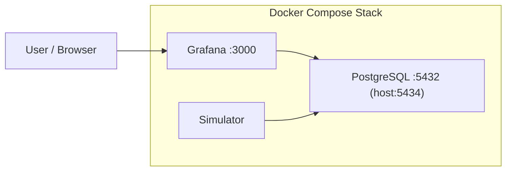
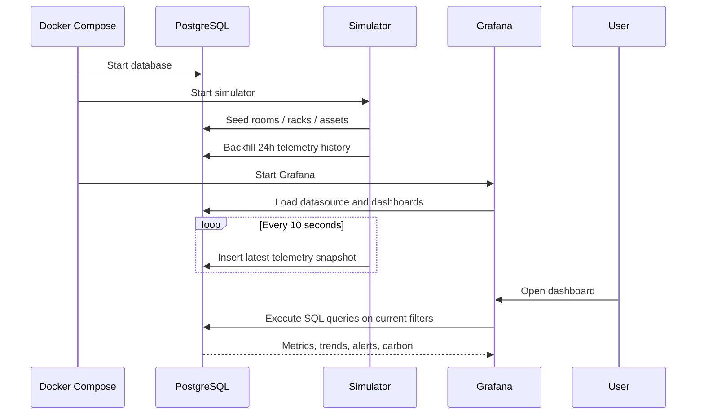

# Architecture — iDT4GDC Grafana Operations Demo

**Version:** Demo Build  
**Stack:** Grafana 11 · PostgreSQL 16 · Python 3.12 · Docker Compose

---

## Table of Contents

1. [System Overview](#1-system-overview)
2. [Repository Structure](#2-repository-structure)
3. [Runtime Topology](#3-runtime-topology)
4. [Telemetry Lifecycle](#4-telemetry-lifecycle)
5. [Persistence Model](#5-persistence-model)
6. [Dashboard Architecture](#6-dashboard-architecture)
7. [Filtering and Drill-Down Model](#7-filtering-and-drill-down-model)
8. [Alerting and Carbon Logic](#8-alerting-and-carbon-logic)
9. [Deployment and Local Run](#9-deployment-and-local-run)
10. [Operational Notes](#10-operational-notes)
11. [Design Decisions and Trade-offs](#11-design-decisions-and-trade-offs)
12. [Future Extensions](#12-future-extensions)

---

## 1. System Overview

This repository delivers a **Grafana-first operations dashboard demo** for iDT4GDC.  
It is designed to feel closer to a real control-room deployment than a custom application shell:

- Grafana provides the dashboard, filtering, refresh, and panel framework
- PostgreSQL acts as the telemetry store and query backend
- A Python simulator generates pseudo-live room / rack / server telemetry
- Provisioned dashboards expose:
  - Connect Data Centre
  - Overview
  - Analytics
  - Carbon
  - Sustainability KPIs
  - AI Optimisation
  - GPU-FPGA Acceleration

The platform is intentionally demo-oriented:

- topology is realistic but synthetic
- telemetry is simulated, not production data
- refresh cadence is accelerated for presentations
- threshold logic is simple and explainable

---

## 2. Repository Structure

```text
idt4gdc-grafana-demo/
├── docker-compose.yml
├── README.md
│
├── postgres/
│   └── init/
│       └── 001-schema.sql
│
├── simulator/
│   ├── Dockerfile
│   ├── requirements.txt
│   ├── app.py
│   └── data/
│       ├── ai_model_results.json
│       ├── data_centres.json
│       ├── gpu_fpga_acceleration.json
│       └── sustainability_kpis.json
│
├── grafana/
│   ├── dashboards/
│   │   ├── connect_data_centre.json
│   │   ├── overview.json
│   │   ├── analytics.json
│   │   ├── carbon.json
│   │   ├── sustainability_kpis.json
│   │   ├── ai_optimisation.json
│   │   └── gpu_fpga_acceleration.json
│   └── provisioning/
│       ├── datasources/
│       │   └── postgres.yml
│       └── dashboards/
│           └── dashboards.yml
│
└── scripts/
    └── generate_dashboards.py
```

### Responsibility split

- `postgres/init/001-schema.sql`
  - schema, indexes, views, alert views
- `simulator/app.py`
  - dimensions, asset topology, pseudo-live telemetry generation
  - KPI snapshot generation
  - AI and acceleration demo seeding
- `simulator/data/*`
  - sample data-centre profiles
  - AI model benchmark data
  - sustainability KPI definitions
  - GPU / FPGA optimisation story data
- `scripts/generate_dashboards.py`
  - Grafana dashboard JSON generation
  - left-side demo navigation
  - fake connection flow wiring
- `grafana/provisioning/*`
  - datasource and dashboard bootstrapping

---

## 3. Runtime Topology



### Container roles

- **PostgreSQL**
  - stores topology, telemetry, and derived views
- **Simulator**
  - seeds dimensions
  - backfills history
  - inserts live telemetry snapshots every 10 seconds
  - derives sustainability KPI snapshots from telemetry
  - seeds AI model comparison and GPU/FPGA optimisation scenario data
- **Grafana**
  - serves dashboards
  - queries PostgreSQL directly
  - applies data-centre and room / rack / server filters
  - acts as the demo shell through provisioned dashboard navigation

### Compose configuration

Defined in [/Users/westerops/Desktop/idt-codex/idt4gdc-grafana-demo/docker-compose.yml](/Users/westerops/Desktop/idt-codex/idt4gdc-grafana-demo/docker-compose.yml).

Notable runtime settings:

- PostgreSQL database: `opsdemo`
- Simulator history seed: `24` hours
- Historical step size: `300` seconds
- Live refresh interval: `10` seconds
- Grafana plugin install: `briangann-gauge-panel`

---

## 4. Telemetry Lifecycle

The demo behaves like a small monitoring platform with synthetic but structured telemetry.

### Lifecycle summary



### Telemetry generation model

Implemented in [/Users/westerops/Desktop/idt-codex/idt4gdc-grafana-demo/simulator/app.py](/Users/westerops/Desktop/idt-codex/idt4gdc-grafana-demo/simulator/app.py).

Each asset snapshot calculates:

- `cpu_usage`
- `power_w`
- `inlet_temp_c`
- `outlet_temp_c`
- `emission_factor_kg_per_kwh`
- `carbon_kg`
- `status_level`
- `operational_state`

The simulator uses:

- business-cycle sine waves
- rack and room phase offsets
- GPU burst patterns
- storage-node lower-load behavior
- maintenance / standby windows for selected assets
- small random noise to avoid flat dashboard shapes

This creates dashboards that look live, variable, and operationally plausible without requiring external systems.

---

## 5. Persistence Model

Defined in [/Users/westerops/Desktop/idt-codex/idt4gdc-grafana-demo/postgres/init/001-schema.sql](/Users/westerops/Desktop/idt-codex/idt4gdc-grafana-demo/postgres/init/001-schema.sql).

### Core tables

#### `rooms`
- logical facility zones

#### `racks`
- belongs to a room
- includes:
  - `capacity_u`
  - `power_capacity_w`

#### `assets`
- room / rack / server inventory
- includes:
  - asset type
  - U position
  - U height
  - accessibility
  - nominal power

#### `telemetry_metrics`
- time-series fact table
- primary key: `(ts, asset_id)`

### Derived views

#### `latest_asset_metrics`
- most recent record per asset

#### `latest_rack_metrics`
- aggregated current rack state

#### `latest_room_metrics`
- aggregated current room state

#### `latest_site_summary`
- site-wide current status

#### `active_alerts`
- view-backed rule output for live dashboard alerts

#### `sustainability_kpi_snapshots`
- historical KPI series derived from simulated operational telemetry

#### `ai_model_results`
- model comparison metadata for the AI energy optimisation story

#### `data_centre_sources`
- fake but structured site connection profiles used by the Connect page

#### `gpu_fpga_*`
- hardware acceleration scenario tables for the fraud-detection story

### Why views are important

The dashboards intentionally query views for current-state panels so that:

- Grafana queries stay simpler
- current-state cards remain fast
- alert and summary logic is centralized in SQL

---

## 6. Dashboard Architecture

Dashboard generation is implemented in [/Users/westerops/Desktop/idt-codex/idt4gdc-grafana-demo/scripts/generate_dashboards.py](/Users/westerops/Desktop/idt-codex/idt4gdc-grafana-demo/scripts/generate_dashboards.py).

The generator produces seven provisioned dashboards:

- [/Users/westerops/Desktop/idt-codex/idt4gdc-grafana-demo/grafana/dashboards/connect_data_centre.json](/Users/westerops/Desktop/idt-codex/idt4gdc-grafana-demo/grafana/dashboards/connect_data_centre.json)
- [/Users/westerops/Desktop/idt-codex/idt4gdc-grafana-demo/grafana/dashboards/overview.json](/Users/westerops/Desktop/idt-codex/idt4gdc-grafana-demo/grafana/dashboards/overview.json)
- [/Users/westerops/Desktop/idt-codex/idt4gdc-grafana-demo/grafana/dashboards/analytics.json](/Users/westerops/Desktop/idt-codex/idt4gdc-grafana-demo/grafana/dashboards/analytics.json)
- [/Users/westerops/Desktop/idt-codex/idt4gdc-grafana-demo/grafana/dashboards/carbon.json](/Users/westerops/Desktop/idt-codex/idt4gdc-grafana-demo/grafana/dashboards/carbon.json)
- [/Users/westerops/Desktop/idt-codex/idt4gdc-grafana-demo/grafana/dashboards/sustainability_kpis.json](/Users/westerops/Desktop/idt-codex/idt4gdc-grafana-demo/grafana/dashboards/sustainability_kpis.json)
- [/Users/westerops/Desktop/idt-codex/idt4gdc-grafana-demo/grafana/dashboards/ai_optimisation.json](/Users/westerops/Desktop/idt-codex/idt4gdc-grafana-demo/grafana/dashboards/ai_optimisation.json)
- [/Users/westerops/Desktop/idt-codex/idt4gdc-grafana-demo/grafana/dashboards/gpu_fpga_acceleration.json](/Users/westerops/Desktop/idt-codex/idt4gdc-grafana-demo/grafana/dashboards/gpu_fpga_acceleration.json)

### Connect Data Centre dashboard

Focus:

- demo-friendly fake connection flow
- selectable data-centre profiles
- editable connection context fields
- handoff into operational dashboards
- left-side navigation across the whole demo

### Overview dashboard

Focus:

- current site status
- connected site context
- live KPI cards
- trend lines
- rack contribution
- active alerts
- live asset table

Panels include:

- stat cards
- animated needle gauges
- time-series charts
- bar gauges
- operational tables

### Analytics dashboard

Focus:

- forecasted draw
- anomaly pressure
- thermal peaks
- operational load patterns
- per-rack and per-asset analysis

### Carbon dashboard

Focus:

- live carbon pulse
- emission-factor visibility
- power-to-carbon relationship
- asset-level carbon hotspots
- sustainability-oriented operational view

### Sustainability KPIs dashboard

Focus:

- D3.2-aligned sustainability metrics
- current and historical KPI visibility
- gauge-based efficiency interpretation
- baseline versus current carbon comparison
- advanced KPI section for demo storytelling

### AI Optimisation dashboard

Focus:

- telemetry-driven power modelling story
- model comparison across LSTM / Random Forest / XGBoost families
- accuracy versus energy trade-off
- predicted versus actual power comparison
- feature importance and AI outcome summary

### GPU-FPGA Acceleration dashboard

Focus:

- workload orchestration story for fraud detection
- hardware platform comparison
- scenario controls and operational phases
- energy and latency improvement narrative

### Gauge implementation

The repo uses the **D3 Gauge plugin** for needle-style panels:

- plugin id: `briangann-gauge-panel`
- installed automatically through Compose
- configured with animated needle transitions

This gives the Grafana demo a more instrument-like, NOC-style presentation than the native gauge panel.

---

## 7. Filtering and Drill-Down Model

The dashboards are driven by a small set of Grafana variables:

- `data_centre`
- `site_location`
- `site_ip`
- `username`

- `room`
- `rack`
- `server`

Additional page-specific variables include:

- `ai_model`
- `scenario_phase`

These are generated in [/Users/westerops/Desktop/idt-codex/idt4gdc-grafana-demo/scripts/generate_dashboards.py](/Users/westerops/Desktop/idt-codex/idt4gdc-grafana-demo/scripts/generate_dashboards.py) and applied consistently across all dashboard SQL.

### Query behavior

- `room` filters available racks
- `rack` filters available servers
- `data_centre` carries the selected site context across dashboards
- all panel SQL applies the same filter logic
- `All` is handled through quoted raw Grafana variables to avoid SQL templating issues

### Why this matters

This repo deliberately supports:

- site-wide operations view
- fake site connection and context handoff
- room-level drill-down
- rack-level drill-down
- server-level isolation

without switching dashboards.

---

## 8. Alerting and Carbon Logic

### Alert rules

Alerts are expressed in SQL through the `active_alerts` view.

Current rules include:

- **CPU saturation**
  - critical at `cpu_usage >= 90`
- **Thermal envelope**
  - warning at `outlet_temp_c >= 34`
  - critical at `outlet_temp_c >= 36`
- **Power spike**
  - warning at `>= 1.08 × nominal power`
  - critical at `>= 1.18 × nominal power`
- **Operational state**
  - warning for `maintenance` and `standby`

### Carbon model

Carbon is estimated from instantaneous power:

```text
carbon_kg = (power_w / 1000) × emission_factor_kg_per_kwh
```

Emission factor itself is dynamic, not static:

- shaped by a daily renewable / balancing curve
- bounded to a realistic demo range
- visible in the Carbon dashboard

This keeps carbon behavior linked to operational load while still remaining easy to explain in a demo.

---

## 9. Deployment and Local Run

### Start the demo

```bash
cd /Users/westerops/Desktop/idt-codex/idt4gdc-grafana-demo
python3 scripts/generate_dashboards.py
docker compose up -d --build
```

### Access

- Grafana: [http://localhost:3000](http://localhost:3000)
- Username: `admin`
- Password: `admin`
- PostgreSQL: `localhost:5434`

Recommended entry point:

- [http://localhost:3000/d/idt4-connect/connect-data-centre?refresh=10s](http://localhost:3000/d/idt4-connect/connect-data-centre?refresh=10s)

### Stop the stack

```bash
cd /Users/westerops/Desktop/idt-codex/idt4gdc-grafana-demo
docker compose down
```

### Rebuild after dashboard changes

```bash
cd /Users/westerops/Desktop/idt-codex/idt4gdc-grafana-demo
python3 scripts/generate_dashboards.py
docker compose up -d --build
```

If dashboard JSON changes are not visible immediately, do a hard refresh in the browser.

---

## 10. Operational Notes

### Initial state

On a fresh run:

- dimensions are seeded
- the simulator backfills the last 24 hours
- Grafana provisions dashboards automatically
- the default home dashboard is the Connect Data Centre page

### Refresh behavior

- live telemetry inserts every `10` seconds
- Grafana dashboards auto-refresh every `10` seconds

### Data characteristics

This repo contains **simulated demo telemetry**, not real production telemetry.

That is intentional because the objective is:

- local reproducibility
- easy demos
- controllable operational patterns
- no dependency on external DCIM or telemetry systems
- fake connection flow is UI-driven rather than truly stateful authentication

---

## 11. Design Decisions and Trade-offs

### Why Grafana

Grafana was chosen for this demo because it gives:

- credible operations-dashboard UX
- native auto-refresh
- mature dashboard interactions
- easy filtering and drilling
- fast time-to-demo
- enough flexibility to simulate a product journey without building a full custom frontend

### Why PostgreSQL instead of a TSDB

PostgreSQL is sufficient here because:

- dataset size is small
- queries are explainable
- schema is easy to inspect
- setup is simpler for local reviewers

### Why a simulator instead of static CSV

Pseudo-live simulation is preferred because it:

- makes dashboards feel active
- keeps alert counts moving
- lets gauges and trends change naturally
- better resembles a monitoring environment

### Known limitations

- no external authentication integration
- no real DCIM or BMS connection
- no persisted Grafana user state between clean recreations
- no custom rack-layout Digital Twin screen inside Grafana
- the connection flow is simulated through dashboard variables and links, not a true backend session

---

## 12. Future Extensions

The next realistic upgrade paths are:

1. Replace simulator input with a real ingestion adapter
   - Prometheus
   - Kafka
   - MQTT
   - DCIM export

2. Add a rack-layout / floor-layout dashboard
   - Canvas panel
   - SVG panel
   - external plugin-based topology panel

3. Expand carbon analytics
   - per-room sustainability KPIs
   - renewable share overlays
   - trend comparison windows

4. Introduce role-based access and multiple demo personas

5. Add incident workflows
   - acknowledgement
   - maintenance windows
   - recovery tracking

---

## Summary

This repository is best understood as a **self-contained, pseudo-live operations dashboard demo** for iDT4GDC:

- PostgreSQL provides the operational data model
- the simulator provides realistic changing telemetry
- Grafana provides the monitoring experience
- dashboards provide current-state, analytic, and carbon visibility
- AI and sustainability modules extend the story from monitoring into optimisation and KPI interpretation

It is intentionally simple to run, easy to explain, and strong enough for stakeholder review, internal demos, and architecture discussions.
